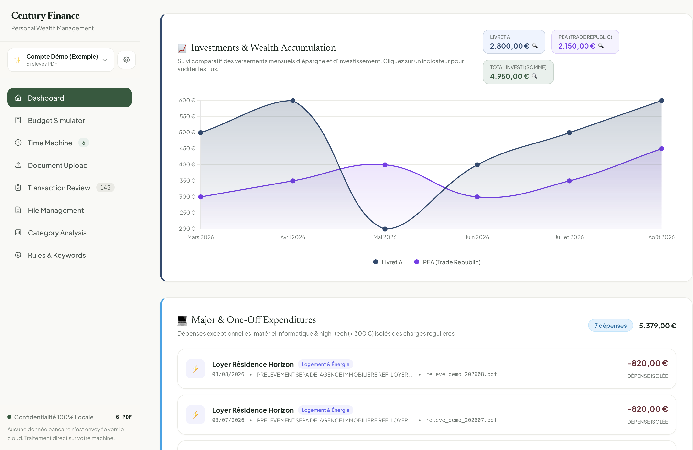
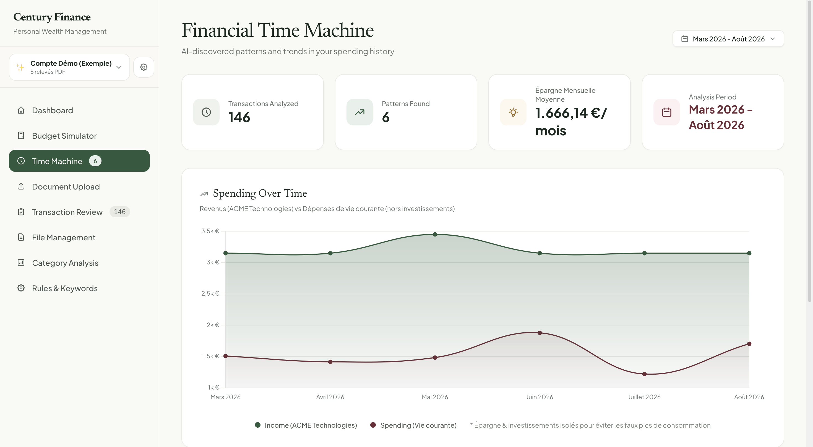
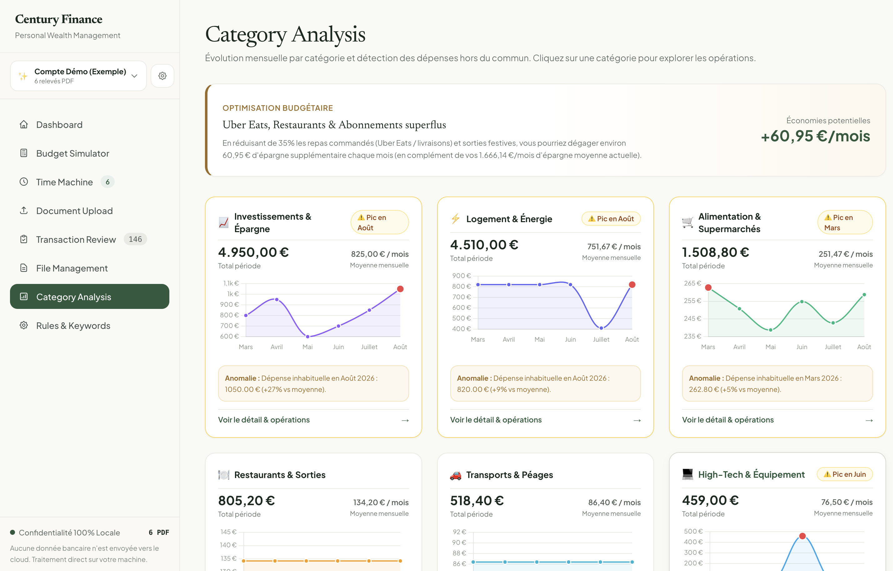

# 🏛️ Century Finance — Gestionnaire & Visualiseur de Relevés Bancaires

<p align="center">
  
  
  
  
</p>

**Century Finance** est une application web moderne et élégante conçue pour transformer vos relevés bancaires PDF en un tableau de bord financier interactif et esthétique (inspiré du design *Mid-Century Modern* et des standards éditoriaux de *Monarch Money*), **sans qu'aucun octet ni aucune donnée financière ne quitte votre machine**.

Aucune synchronisation bancaire tierce, aucun identifiant partagé, aucun abonnement payant : déposez simplement vos relevés bancaires PDF officiels et visualisez instantanément votre patrimoine, vos postes de dépenses et votre capacité d'épargne.

---

## 📸 Aperçu de l'Interface

### 1. Tableau de Bord & Accumulation Patrimoniale
Suivez l'évolution comparée de vos flux d'épargne et d'investissement (Livret A, PEA, CTO, etc.) et isolez vos dépenses majeures ou exceptionnelles des dépenses de vie courante.



---

### 2. Machine Temporelle Financière (Time Machine)
Analysez vos tendances sur plusieurs mois : comparaison automatique entre vos revenus réels et vos dépenses de vie courante, calcul rigoureux de votre capacité d'épargne moyenne et détection des motifs financiers récurrents.



---

### 3. Analyse par Catégorie & Détection d'Anomalies
Visualisez vos dépenses réparties sur 14 catégories avec des mini-graphiques mensuels (*sparklines*), détection instantanée des pics inhabituels (+% vs moyenne) et suggestions concrètes d'optimisation budgétaire.



---

## ✨ Fonctionnalités Principales

### 🔒 1. Confidentialité Absolue (100% Local-First)
- **Zéro Cloud** : Aucune donnée bancaire n'est envoyée à des serveurs distants. Tout le traitement (parsing PDF, indexation, classification, calculs analytiques) se déroule exclusivement en local sur votre ordinateur.
- **Dépôt Git sécurisé** : Le fichier `.gitignore` est préconfiguré pour exclure automatiquement tous vos relevés PDF, fichiers de cache et règles privées.

### 📂 2. Gestion Multi-Espaces (Workspaces)
- Créez des espaces indépendants pour chaque situation : **Compte Courant**, **Compte Pro / Freelance**, **Compte Joint**, etc.
- Chaque espace possède son propre dossier de documents PDF, son cache d'opérations et ses règles d'analyse personnalisées.
- **Espace Démo pré-intégré** : Explorez immédiatement l'application avec 6 mois d'opérations synthétiques anonymisées sans importer vos propres données.

### 📈 3. Suivi d'Investissement & Épargne Dynamique
- Configurez librement vos comptes d'investissement (ex: *PEA Trade Republic*, *Livret A*, *CTO Interactive Brokers*, *Assurance Vie*).
- Les versements d'épargne ne sont **pas comptabilisés comme des dépenses de consommation**, préservant ainsi la réalité de votre train de vie.
- Suivi visuel de l'effort d'épargne mensuel avec courbes comparatives et cumul patrimonial.

### ⚖️ 4. Neutralisation Automatique du Loyer & Remboursements
- Si vous payez un loyer groupé et recevez un virement de remboursement (ex: colocataire, conjoint), Century Finance applique une **compensation directe** : seule votre part nette est imputée à vos charges de logement.

### ⏳ 5. Machine Temporelle & Métriques Fiables
- **Épargne Mensuelle Moyenne** : Différence réelle entre vos flux entrants réguliers (salaire, primes) et vos charges de vie courante nettes.
- **Potentiel d'Épargne** : Estimation des économies réalisables en optimisant vos dépenses discrétionnaires (sorties, livraisons, abonnements superflus).
- **Audit de calcul pas-à-pas** : Cliquez sur n'importe quel indicateur pour afficher la formule mathématique exacte et la liste exhaustive des transactions associées.

### 🧮 6. Simulateur de Budget Prévisionnel
- Testez différents scénarios financiers (augmentation de salaire, déménagement, réallocation d'épargne).
- Initialisé automatiquement à partir de l'historique réel de vos charges sur les derniers mois.
- Visualisation de la règle budgétaire **50 / 30 / 20** (Besoins / Envies / Épargne) et calcul instantané du **Reste à Vivre**.

### 🏷️ 7. Moteur de Règles & Révision des Transactions
- Table complète de révision de vos transactions avec recherche en direct, tri et pagination.
- Réaffectez la catégorie d'une dépense en 1 clic : Century Finance vous propose de retenir automatiquement un mot-clé pour classifier de manière pérenne les futures occurrences.
- Export CSV instantané (vue globale ou filtre par catégorie).

---

## 🧠 Classification Intelligente & Local LLM avec Ollama

Century Finance intègre un moteur de classification **hybride à 3 niveaux** :
1. **Règles utilisateur personnalisées** : vos choix manuels sont toujours prioritaires.
2. **Moteur heuristique déterministe** : dictionnaire exhaustif de regex et mots-clés couvrant plus de 95% des commerçants et libellés bancaires courants (supermarchés, transports, santé, impôts...).
3. **LLM Local (Optionnel via Ollama)** : pour les libellés vagues, abréviations de TPE ou commerçants locaux inconnus (ex: `SQ *BOULANGERIE`, `SUMUP *CAFE`).

> 💡 **Ollama est 100% optionnel** : si Ollama n'est pas installé ou n'est pas démarré, Century Finance fonctionne immédiatement et silencieusement à 100% de ses capacités avec son moteur déterministe ultra-rapide.

### Guide de configuration d'Ollama

#### 1. Installer Ollama
- **macOS** (via Homebrew ou téléchargement direct) :
  ```bash
  brew install ollama
  ```
- **Linux** :
  ```bash
  curl -fsSL https://ollama.com/install.sh | sh
  ```
- **Windows** : Téléchargez l'installateur officiel sur [ollama.com/download](https://ollama.com/download).

#### 2. Démarrer le service local
Dans un terminal, démarrez le démon Ollama (ou ouvrez l'application bureau sous macOS/Windows) :
```bash
ollama serve
```

#### 3. Télécharger un modèle recommandé
Century Finance est optimisé pour les modèles francophones rapides et compacts :
```bash
# Modèle recommandé (excellent équilibre vitesse / précision en français) :
ollama pull qwen2.5:7b

# Alternative ultra-légère (machines plus modestes ou portables) :
ollama pull llama3.2:3b
```

Une fois le modèle téléchargé, Century Finance détecte automatiquement la présence d'Ollama sur `http://localhost:11434` sans aucune configuration manuelle requise.

---

## 🚀 Installation & Démarrage Rapide

### 1. Prérequis
- Python 3.10 ou supérieur
- Navigateur web moderne (Chrome, Firefox, Safari, Edge)

### 2. Cloner et installer le projet

```bash
# 1. Cloner le dépôt
git clone https://github.com/votre-nom/century-finance.git
cd century-finance

# 2. Créer un environnement virtuel
python3 -m venv .venv

# 3. Activer l'environnement
source .venv/bin/activate       # Sur macOS / Linux
# .venv\Scripts\activate        # Sur Windows

# 4. Installer les dépendances
pip install -r requirements.txt
```

### 3. Démarrer le serveur

```bash
python app.py
```

Ouvrez ensuite votre navigateur sur **[http://localhost:5001](http://localhost:5001)**.

---

## 📖 Guide d'Utilisation

1. **Découverte immédiate** :
   À la première ouverture, vous arrivez sur le **Compte Démo**. Vous pouvez explorer l'ensemble des écrans (Tableau de bord, Simulateur, Time Machine, Catégories, Révision) avec des données réalistes.

2. **Créer votre espace personnel** :
   - Cliquez sur l'icône d'engrenage ⚙️ ou sur le sélecteur d'espace dans la barre latérale pour créer votre propre espace (ex: *Mon Compte Courant*).
   - Déposez vos relevés bancaires au format PDF dans l'onglet **Document Upload** (glisser-déposer de plusieurs fichiers supporté).

3. **Configurer votre profil financier** :
   Dans l'onglet **Configuration** de votre espace, personnalisez vos paramètres :
   - Nom de votre employeur (pour isoler votre salaire).
   - Mots-clés de neutralisation du loyer.
   - Vos comptes d'épargne et de courtage (PEA, Livret A, LDDS, Crypto, etc.).

4. **Ajuster vos catégories** :
   Rendez-vous dans **Transaction Review** pour vérifier les libellés. Si une dépense doit changer de catégorie, sélectionnez la nouvelle catégorie : l'apprentissage est immédiat pour tous les relevés passés et futurs.

---

## 📁 Architecture du Projet

```text
century-finance/
├── app.py                  # Serveur Flask & endpoints de l'API REST
├── analytics.py            # Moteur de calculs financiers, métriques d'épargne & projections
├── classifier.py           # Classification hybride (règles locales + fallback Ollama)
├── config.py               # Palette graphique, catégories, icônes & regex universelles
├── extractor.py            # Extraction robuste de texte et tableaux PDF (PyMuPDF)
├── main.py                 # Interface en ligne de commande (CLI)
├── requirements.txt        # Dépendances Python (Flask, PyMuPDF, Pandas...)
├── templates/
│   └── index.html          # Interface Single-Page Application (TailwindCSS + Chart.js)
├── docs/
│   └── screenshots/        # Captures d'écran de l'application
├── workspaces/
│   ├── demo/               # Espace de démonstration public (synthétique)
│   │   ├── meta.json       # Configuration de l'espace démo
│   │   ├── user_rules.json # Règles de catégorisation démo
│   │   └── cache/          # Relevés pré-analysés anonymisés (Mars - Août 2026)
│   └── default/            # Votre espace personnel (100% ignoré par git)
└── .gitignore              # Règles strictes d'exclusion de toutes données personnelles
```

---

## 🛡️ Sécurité & Données Privées

La sécurité de vos données financières est le principe fondateur de Century Finance :
- **Aucune base de données externe requise** : vos relevés analysés sont stockés sous forme de fichiers JSON locaux dans le dossier de votre espace de travail.
- **Règles git hermétiques** : Les répertoires `workspaces/*/statements/*.pdf` et `workspaces/*/cache/*.json` (à l'exception exclusive du dossier `workspaces/demo/`) sont bloqués par `.gitignore`.
- Vous pouvez synchroniser le code de ce dépôt sur GitHub ou GitLab en toute tranquillité, sans risque de fuite de données personnelles.